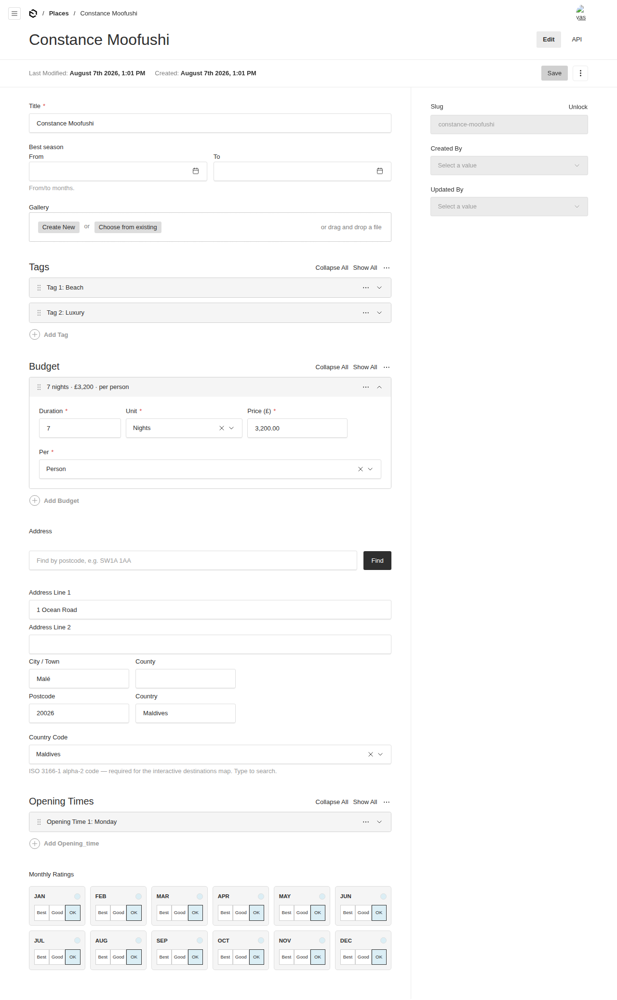
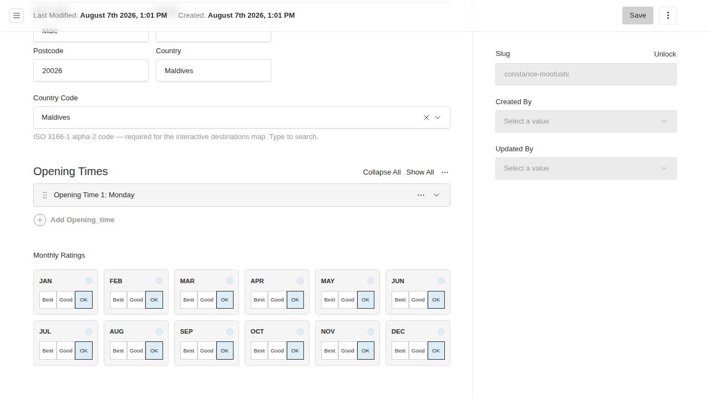

# @foundrykit/payload-fields

A pack of reusable, self-contained custom fields for [Payload CMS 3](https://payloadcms.com) — the ones you end up rebuilding on every project. Import only what you use; each is a small factory that returns a standard Payload field config.

Extracted from the Turquoise project, with the app-specific coupling removed (the shared `deepMerge` helper is vendored in, and every custom admin component resolves from this package).

## What's included

| Import | Returns | What it does |
|---|---|---|
| `slugField(from?)` | `[TextField, CheckboxField]` | Auto-formatted slug (accent-transliterated) with a lock toggle. |
| `dateRangeField({name})` | `GroupField` | A from/to pair as two month pickers. |
| `gallery({relationTo?})` | upload `Field` | `hasMany` image gallery (defaults to the `media` collection). |
| `tags()` | array `Field` | Repeatable free-text tags with tidy row labels. |
| `budgetField()` | array `Field` | Pricing rows (duration + formatted price + per-unit) with conditional clarifications. |
| `address()` | `GroupField` | Structured UK address with a free **postcode lookup** (api.postcodes.io). |
| `countryCodeField()` | `SelectField` | Searchable ISO 3166-1 alpha-2 country select (full list). |
| `changedByFields()` + `populateChangedBy` | `[RelationshipField, RelationshipField]` + hook | `createdBy`/`updatedBy` audit fields, per-version. |
| `openingTimes()` | array `Field` | Day / open / close opening-hours list. |
| `bestTimeToVisitMonths()` | array `Field` | A 12-month best/good/ok grid with a custom editor UI. |

## Screenshots

**All fields on one document** — slug + audit fields in the sidebar, date range, gallery, tags, budget, address (postcode lookup), country code, opening times and the month grid



**Best-time-to-visit month grid**



---

## Installation

```sh
pnpm add @foundrykit/payload-fields
```

Peer deps: `payload`, and `@payloadcms/ui` + `react` for the fields that ship an admin component.

After adding fields that use custom components, run `payload generate:importmap` (Payload does this automatically on dev/build). The components resolve from `@foundrykit/payload-fields/client`.

## Usage

```ts
// a collection
import {
  address, bestTimeToVisitMonths, budgetField, changedByFields, countryCodeField,
  dateRangeField, gallery, openingTimes, populateChangedBy, slugField, tags,
} from '@foundrykit/payload-fields'
import type { CollectionConfig } from 'payload'

export const Places: CollectionConfig = {
  slug: 'places',
  hooks: { beforeChange: [populateChangedBy] },
  fields: [
    { name: 'title', type: 'text', required: true },
    ...slugField('title'),                 // spreads [slug, slugLock]
    dateRangeField({ name: 'season', label: 'Best season' }),
    gallery(),                             // gallery({ relationTo: 'assets' }) to point elsewhere
    tags(),
    budgetField(),
    address(),
    countryCodeField({ required: true }),
    openingTimes(),
    bestTimeToVisitMonths(),
    ...changedByFields(),                  // createdBy + updatedBy in the sidebar
  ],
}
```

Every factory takes an `overrides` (or explicit options) argument so you can rename, reposition, or extend the field without forking it.

### Notes on individual fields

- **slug** — formats from the source field (default `title`), transliterating accents (`Réunion → reunion`). The lock toggle lets editors set a slug by hand; unlock re-syncs it. `formatSlug`/`formatSlugHook` are exported for reuse.
- **address** — the postcode lookup calls the free, key-less `api.postcodes.io`; editors can always fall back to manual entry. UK-oriented, but the fields are plain text so any address works.
- **changedBy** — because Payload versions snapshot the whole document, `createdBy`/`updatedBy` give you per-version authorship for free. Point at a non-default users collection with `changedByFields({ usersCollection })`.
- **bestTimeToVisit** — the month colours use CSS custom properties (`--btv-best` / `--btv-good` / `--btv-ok`) with neutral defaults; override them in your admin CSS to rebrand.

## Exports

- `@foundrykit/payload-fields` — all field factories, `formatSlug`/`formatSlugHook`, `populateChangedBy`, `ISO_COUNTRY_OPTIONS`, `deepMerge`.
- `@foundrykit/payload-fields/client` — the admin components (registered via the import map; you don't import these directly).

## Development

```sh
pnpm install
pnpm dev          # dev admin at http://localhost:3000/admin — a "places" collection using every field
pnpm test         # unit + integration + e2e
pnpm test:unit    # slug formatting
pnpm test:int     # every field registers + slug/changedBy behaviour on a real Payload instance
pnpm build && pnpm verify:pack
```

## License

MIT © Isaac SJ / Umi
